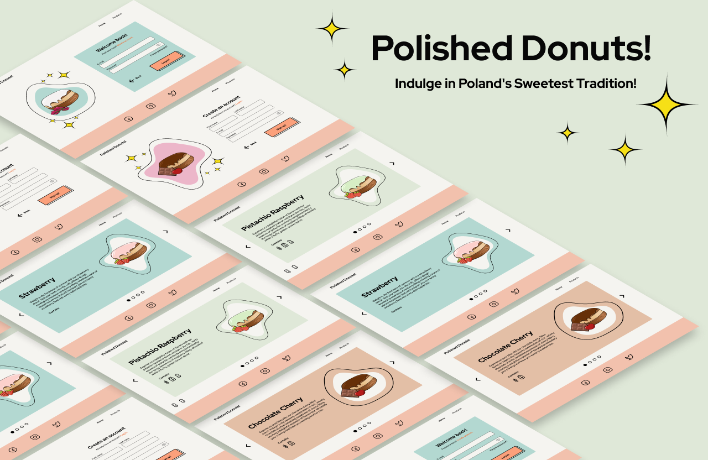

# Polished Donuts!

Welcome to Polished Donuts, the online haven for delicious Polish-style donuts!



## Description

Polished Donuts is a web application that brings the joy of Polish-style donuts to the digital world. While the project is still in its working phase, users can already explore information about the donut store and learn about the rich history of Polish-style donuts. The website also provides account functionality, allowing users to create an account and log in securely.

In the future, we plan to transform this platform into an online store where users can not only read about donuts but also subscribe to receive these delectable treats at their doorstep.

Here is a short presentation video: https://www.linkedin.com/feed/update/urn:li:activity:7083112675014049792/

## Features

- **Read About Donuts:**
  Explore information about the donut store and the fascinating history of Polish-style donuts.

- **Account Management:**
  Create an account and log in securely to personalize your experience on the platform.

- **Upcoming Feature - Online Store:**
  Stay tuned for the launch of our online store, where you can easily subscribe to receive a regular supply of delightful donuts.

## Installation

To run Polished Donuts locally, follow these steps:

1. Clone the repository:
   ```bash
   git clone https://github.com/KatKowalik/polished-donuts.git

2. Navigate to the project directory:

   ```bash
   cd polished-donuts

3. Install dependencies for the frontend and backend:

   ```bash
   cd polished-donuts
   npm install

   cd polished-donuts-server
   npm install

4. Install MongoDB and Mongoose.

## Contact

For any questions, suggestions, or support, feel free to reach out to us at katarzyna.kowalik2@gmail.com.

